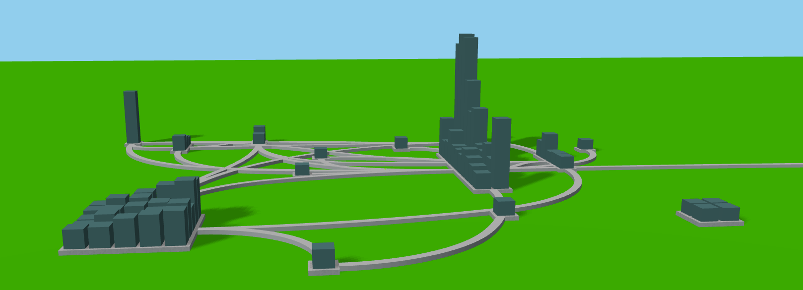

# Viseagull

An open-source software visualization and exploration tool.



## Introduction

---

The goal of this tool is to visualize the "hidden" architecture of a repository. Each repository has an explicit architecture defined by the folders and files tree structure, but it also has a "hidden" architecture defined by the way files are coupled together in practice. Knowing this can help gain insights to better understand and navigate the codebase.

This tool works in two phases :
1. It first analyzes a repository to detect the couplings between the files, and cluster strongly coupled files together,
2. It then creates an interactive visualization of the repository based on the results of the analysis.

Two types of couplings can be used for the analysis based on the user choice :
- Logical couplings: two files are coupled logically if they have been modified in the same commits (the more common commits, the more coupled they are).
- Semantic couplings: two files are semantically coupled if they share a common lexicon.

## Getting started

---

### Installation

Python 3.7+ is required to use the tool. It is advised to use a virtual environment to install and use the tool, you can easily create and activate one using :
```
python3 -m venv venv
source venv/bin/activate
```

To install Viseagull you need to clone this repo, go to the download location, and then run
```make setup```.

Alternatively, if the previous command does not work or you do not have ```make``` installed, you can use the following commands instead :

```
python -m pip install --upgrade pip
pip install -r requirements.txt
python ./setup.py build
python ./setup.py install
```

This should install the required dependencies and the tool.


### Using Viseagull

To use Viseagull **you need to place yourself in the folder where you downloaded it.** You can then use the command :
```
viseagull [Url Of Your Repo You Want To Visualize]
```
The url can either be the path to a local repository or the url to an open-source project :
```
viseagull https://github.com/charlesgery/viseagull.git
viseagull C:/<your_name>/viseagull
```

Depending on the size of your project, the analysis can take quite some time.

### Additional parameters

Additional parameters are available. You can get a list of the available parameters by using ```viseagull --help```.

The main parameters are for now :
- ```--logical / --semantic```: the type of analysis you want to run on your repo. Logical is the default one. Semantic analysis only works with repositories with Python files.
- ```--save```: saves the visualization data to quickly load it later without rerunning the analysis.
- ```--load [pathToFile]```: loads existing visualization data to quickly visualize it.


## The visualization

---

The visualization works as follows: each file is represented as a building. Buildings are grouped in clusters/cities based on the results of the clustering analysis.

Roads link clusters/cities that have files that have been modified together in a commit (eg. if we have two clusters A and B, if file 1 from cluster A has been modified in common commit with file 2 from cluster B, there will be a road between the two clusters). Each road has a width (not represented visually for now, but can be obtained by hovering over the road), the width is the number of commits in which at least of file from the first cluster and a file from the second cluster were modified at the same time.

The distances between the clusters/cities are based on the similarity between them. Clusters with strongly coupled files should be closer.

The GUI displays information on the element you are hovering :
- Name of the file for the buildings
- Width for the roads

When you hover the road, the starting and ending cities will be highlighted.

You can click on any building of a cluster to highlight the cluster and the roads getting in/out of it.

If you used the url to an online open-source repository you can:
- Open a file in a new tab by double-clicking on it,
- Open a commit in a new tab, by selecting it, and then clicking on the corresponding button in the GUI.

### Visualization parameters

Several parameters are available in the visualization :

- Change the color of the buildings based on :
    - Last modification data,
    - Creation date
    In both cases, the more recently a file has been modified/created, the redder it will be.
- Highlight the buildings modified in a commit: if you input the hash of a commit, all the files/buildings modified in it will be colored in blue.
- Display only the roads with a width bigger than X (where the user can choose the value of X). It helps to remove noise (i.e. roads with small width).

### Differences between the visualization of logical and semantic couplings

- Logical couplings :
    - When visualizing logical couplings, the height of the buildings represents the number of times a file has been modified in a commit. The higher, the more commits it has been modified in.
- Semantic couplings :
    - The height of all the buildings is the same.
    - The roads, have the same meaning as in logical couplings. The road still means that files from both clusters have been modified in a common commit. The width also still means the same thing.


